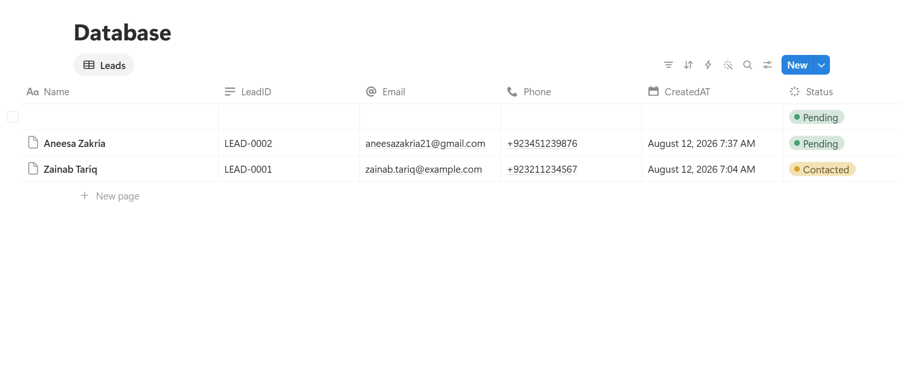
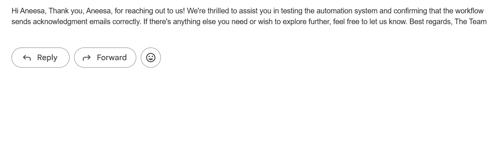
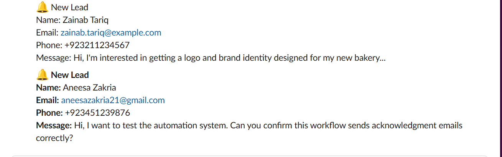

# AI-Powered Lead Tracking and Automated Follow-Up System

An n8n automation that catches new leads the moment they arrive, replies to them automatically with an AI-personalized message, files them into a proper Notion database, alerts the team on Slack, and — if a lead goes quiet — follows up again after 3 days. Built entirely with free tools except OpenAI.


---

## Table of Contents

- [The Problem](#the-problem)
- [What It Does](#what-it-does)
- [Architecture](#architecture)
- [Tools Used](#tools-used)
- [Screenshots](#screenshots)
- [Node Breakdown](#node-breakdown)
- [Data Model](#data-model)
- [Setup Guide](#setup-guide)
- [Testing](#testing)
- [Known Limitations](#known-limitations)
- [Repo Structure](#repo-structure)

---

## The Problem

Leads coming in through a form, ad, or WhatsApp inquiry land as rows in a spreadsheet — and that's where they usually stall.

- **Slow first response.** A lead who messages at night waits until morning, or gets forgotten entirely. Response speed is one of the strongest predictors of whether a lead converts.
- **No reliable record.** A plain spreadsheet has no status tracking, so leads get double-contacted or skipped.
- **Cold leads stay cold.** If a lead doesn't reply the first time, nobody circles back. There's no second attempt.
- **No shared visibility.** The sheet is a dumping ground, not a searchable, filterable database.

## What It Does

1. **Detects a new lead** within about a minute of it landing in Google Sheets.
2. **Normalizes the data** — standardizes the phone number into `+92XXXXXXXXXX` format, trims/lowercases the email, extracts a first name.
3. **Writes a personalized acknowledgment** using OpenAI, referencing what the lead actually asked about.
4. **Creates a structured record in Notion** so the lead becomes part of a real, filterable pipeline.
5. **Emails the lead** the personalized acknowledgment via Gmail.
6. **Alerts the team on Slack** instantly, so a human can jump in on hot leads.
7. **Marks the source row as processed**, so the same lead can never be contacted twice.
8. **Follows up automatically 3 days later** if the lead is still sitting at `Pending`, then marks them `Contacted` so they never get re-emailed.

## Architecture

The system is one n8n workflow file containing two logical, independently-triggered chains:

```
┌─────────────────── LEAD INTAKE & ACKNOWLEDGMENT ───────────────────┐
│                                                                     │
│  New Sheet Row → Filter unprocessed → Normalize data               │
│      → OpenAI writes personalized reply                             │
│      → Create Notion record → Email lead → Alert team (Slack)       │
│      → Write back: Processed / NotionPageId / SentAt / CreatedAt    │
│                                                                     │
└─────────────────────────────────────────────────────────────────────┘
                                  │
                       shared state in Notion
                                  │
┌────────────────────── 3-DAY LEAD FOLLOW-UP ────────────────────────┐
│                                                                     │
│  Daily 9 AM → Fetch Notion pages where Status = Pending             │
│      → Keep only records older than 3 days                          │
│      → Drop any with a missing email                                │
│      → Send follow-up email → Set Notion Status = Contacted         │
│                                                                     │
└─────────────────────────────────────────────────────────────────────┘
```

**Lead Intake** is event-driven — it reacts the instant a row appears. **3-Day Follow-Up** is time-driven — it wakes up once a day and looks backward at what's already there. They never call each other directly; they communicate only through shared state in Notion and Google Sheets, which keeps each half independently testable.

## Tools Used

| Tool | Role | Cost |
|---|---|---|
| **n8n** | Automation engine tying everything together | Free |
| **Google Sheets** | Lead intake point + processing-state tracker | Free |
| **Notion** | The real, structured lead database | Free |
| **Gmail** | Sends the acknowledgment and the follow-up | Free |
| **Slack** | Instant internal team alert | Free |
| **OpenAI** | Writes the personalized acknowledgment text | Paid — roughly $0.01 per 100 leads |

## Screenshots

**Full workflow canvas — both chains on one board**


**Notion lead database**


**Personalized acknowledgment email**


**Team alert in Slack**


**Google Sheet after processing**


## Node Breakdown

### Lead Intake & Acknowledgment

| # | Node | Type | What it does |
|---|---|---|---|
| 1 | Google Sheets Trigger | Trigger | Polls every minute for new rows |
| 2 | Only Unprocessed | Filter | Drops any row where `Processed` isn't empty — the idempotency check |
| 3 | Normalize | Code | Cleans phone/email/name, stamps `createdAt`, carries `LeadID` |
| 4 | Write Reply | AI Agent (OpenAI) | Writes a 3-sentence acknowledgment referencing the lead's actual message |
| 5 | Create Lead Record | Notion | Creates a new database page with Name, LeadID, Email, Phone, Status, CreatedAt |
| 6 | Email Lead | Gmail | Sends the acknowledgment to the lead |
| 7 | Alert Team | Slack | Posts a formatted lead summary to `#new-leads` |
| 8 | Mark Processed | Google Sheets | Updates the row: `Processed`, `NotionPageId`, `SentAt`, `CreatedAt`, `LeadID` |

### 3-Day Lead Follow-Up

| # | Node | Type | What it does |
|---|---|---|---|
| 1 | Schedule Trigger | Trigger | Fires once daily at 9 AM |
| 2 | Get Pending Leads | Notion | Fetches every page where `Status = Pending` |
| 3 | Older Than 3 Days | Code | Filters to records whose `CreatedAt` is 3+ days old |
| 4 | Has Email | Filter | Drops any record with a missing email, so a bad record can't crash the run |
| 5 | Send Follow-Up | Gmail | Sends a re-engagement email |
| 6 | Mark Contacted | Notion | Sets `Status = Contacted` so the lead is never followed up with again |

## Data Model

### Google Sheets — `Leads` / `Sheet1`

| Column | Filled by | Purpose |
|---|---|---|
| Name | Lead | Becomes the Notion page title |
| LeadID | Formula (`=IF(A2="","","LEAD-"&TEXT(ROW()-1,"0000"))`) | Stable unique key across Sheets and Notion |
| Email | Lead | Acknowledgment and follow-up destination |
| Phone | Lead | Normalized to E.164 by the Normalize node |
| Message | Lead | Feeds the OpenAI personalization prompt |
| Processed | Workflow | Idempotency flag — checked before anything else runs |
| NotionPageId | Workflow | Links the row to its Notion record |
| SentAt | Workflow | Acknowledgment timestamp |
| CreatedAt | Workflow | Timestamp used by the 3-day age check |

> The Phone column must be formatted as **Plain Text**, not Number — otherwise Google Sheets strips leading zeros and corrupts the number before it ever reaches n8n.

### Notion — `Leads` database

| Property | Type | Notes |
|---|---|---|
| Name | Title | Required by Notion |
| LeadID | Text | Matches the Sheet's LeadID |
| Email | Email | Must be typed as Email, not Text |
| Phone | Phone | Must be typed as Phone, not Text |
| Status | Select | Options: `Pending`, `Contacted`, `Converted`, `Lost` — must exist before the workflow writes to them |
| CreatedAt | Date | Drives the follow-up age calculation |

> n8n's Notion node returns a **flattened** field structure, not the nested `properties.X.type.value` shape the raw Notion API docs describe. Expect keys like `property_created_at.start`, `property_email`, `property_status` — not `properties.CreatedAt.date.start`.

## Setup Guide

### 1. Google Sheet
Create a sheet named `Leads` with the columns above. Format the Phone column as Plain Text. Add the LeadID formula to the first row and drag it down for future rows.

### 2. Notion database
Create a database with the properties listed above, matching types exactly. Add the four Select options to Status before running anything.

**Critical step:** create a Notion integration at [notion.so/my-integrations](https://notion.so/my-integrations), copy its secret, then open your Leads database → `•••` → **Connections** → connect the integration. Skipping this causes every Notion node to fail with "could not find database" even with a valid API key.

### 3. Slack
Create a Slack app at [api.slack.com/apps](https://api.slack.com/apps) → add `chat:write` and `chat:write.public` bot scopes → install to workspace → copy the bot token → invite the bot to your alert channel.

### 4. Google Cloud (for Sheets + Gmail)
Enable the Sheets API and Gmail API on a Google Cloud project, create an OAuth client, and connect it in n8n — one credential covers both nodes.

### 5. OpenAI
Add your API key as a credential in n8n. `gpt-4o-mini` is sufficient and inexpensive for this workload.

### 6. Import the workflow
Import [`workflows/lead-intake-followup-automation.json`](workflows/lead-intake-followup-automation.json) into n8n, then reconnect each node's credentials to your own accounts — credentials are never included in the export.

## Testing

1. Add a test row to the sheet with all workflow-managed columns left blank.
2. Run the Lead Intake chain manually and confirm a Notion page, acknowledgment email, and Slack alert all appear correctly.
3. Re-run the same chain on the same row — the `Only Unprocessed` filter should block it entirely. This proves no lead can ever be double-contacted.
4. In the `Older Than 3 Days` code node, temporarily set `DAYS = 0` and run the Follow-Up chain — confirm a follow-up email sends and the Notion status flips to `Contacted`.
5. Run the Follow-Up chain again immediately — it should find nothing, since the lead is no longer `Pending`.
6. Set `DAYS` back to `3` before activating for real use.

Sample test data is available in [`sample-data/leads-template.csv`](sample-data/leads-template.csv), including deliberately messy phone formats to verify the normalization logic.

## Known Limitations

- **Email is a semi-unique key.** Two leads sharing the same email address could cause the Sheet update step to match the wrong row. For production use, replace this with a guaranteed-unique ID generated at intake.
- **Status lives in Notion, not the Sheet.** The Google Sheet tracks intake completion (`Processed`); Notion tracks the lead's actual lifecycle (`Pending` → `Contacted`). This is an intentional separation of concerns, not a sync bug.
- **Single follow-up only.** The system sends one re-engagement email at day 3 and then stops. A multi-stage sequence (day 3, 7, 14) would need an additional counter property.
- **Slack/Gmail messages must use expressions, not typed text.** A field left as plain text instead of an `{{ }}` expression will silently freeze on whatever data was present when the node was first configured — worth double-checking any hardcoded-looking output during testing.

## Repo Structure

```
lead-intake-followup-automation/
├── README.md
├── workflows/
│   └── lead-intake-followup-automation.json
├── screenshots/
│   ├── n8n workflow.png
│   ├── notion.png
│   ├── Gmail.png
│   ├── Slack.png
│   └── Google sheet.png
└── sample-data/
    └── leads-template.csv
```

---

Built as part of an AI automation internship project, using n8n, Google Sheets, Notion, Gmail, Slack, and OpenAI.
